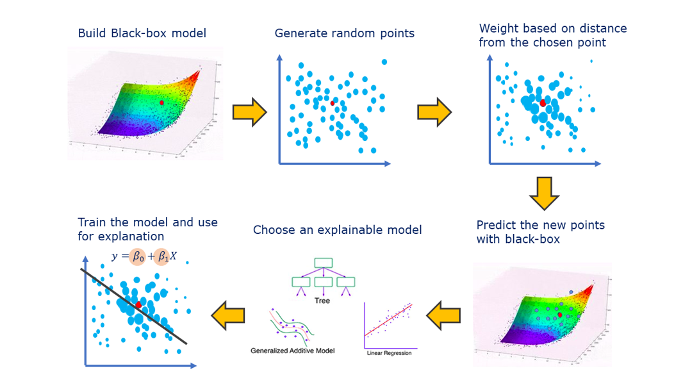

# LIME

-   Modelo a explicar: xgboost
-   Local surrogate model: regresión lineal

# Librerías

```{r message=FALSE, warning=FALSE}
library(data.table)
library(lime)
library(caret)
library(xgboost)
library(kableExtra)
```

# Datos

Usamos datos de una campaña de marketing bancaria. Queremos predecir si un cliente va a aceptar un producto que se le ofrece por una llamada telefónica (subscribed yes o no).

Link al dataset:

[**https://www.kaggle.com/berkayalan/bank-marketing-data-set**](https://www.kaggle.com/berkayalan/bank-marketing-data-set)

```{r echo=TRUE}
dataset = fread("../datasets/bank_marketing_dataset.csv", stringsAsFactors = T)
```

-   Vemos un head del dataset

```{r}
kable(head(dataset), format="simple")
```

# Dividimos en train y test

```{r message=FALSE, warning=FALSE}

# Dividimos el dataset con createDataPartition de caret
set.seed(3456)
inTrain = createDataPartition(
  y = dataset$subscribed, #la clase a predecir
  p = .75, #75% para train
  list = FALSE
)

# Usamos los índices para dividir entre train y test
# Recordatorio: tienen la clase a predecir
training = dataset[ inTrain,]
testing  = dataset[-inTrain,]
```

# Entrenamos xgboost con paquete Caret

```{r echo=TRUE, message=FALSE, warning=FALSE}

#Creamos la grilla de parámetros para xgbTree (los dejamos fijos por ahora)

# gbmGrid = expand.grid(
#   nrounds = 2,
#   max_depth = 3,
#   eta = 0.3,
#   gamma = 0,
#   colsample_bytree = 1,
#   min_child_weight = 1,
#   subsample = 1
# )

#Entrenamos el árbol con todas las variables
fit.xgbTree_all = train(subscribed ~ .,
                     data=training, #usamos los datos de train
                     method="xgbTree")

#tuneGrid=gbmGrid

```

# Predecimos sobre los datos de testing

```{r}
predict(fit.xgbTree_all, testing)[1:200]
```

# Vemos la matriz de confusión y las métricas de performance

```{r}
real_vs_pred = table(testing$subscribed, predict(fit.xgbTree_all, testing))
confusionMatrix(real_vs_pred)
```

# LIME

Pasos:

1)  Dada una observación, la permuta para crear una replica con pequeñas modificaciones en sus features.
2)  Computa una métrica de similaridad entre la observación original y la observación permutada.
3)  Aplica el modelo complejo para predecir la salida de la observación original y las permutadas.
4)  Selecciona m número de variables para describir las salidas del modelo complejo.
5)  Ajusta un modelo simple a los datos permutados. Explica la salida compleja del modelo con las m variables de los datos permutados, pesados por su similaridad a la observación original.
6)  Usa los pesos de cada feature para explicar el comportamiento local del modelo complejo.

- Extraido de: <https://uc-r.github.io/lime>



- Extraido de: <https://towardsdatascience.com/lime-explain-machine-learning-predictions-af8f18189bfe>

# Creamos el objeto explainer con la función lime

```{r message=FALSE, warning=FALSE}
#recibe el dataset de entrenamiento sin la clase, el modelo y el número de bins con el que se van a binnear las variables numéricas
explainer_all = lime(training[,-"subscribed"], fit.xgbTree_all,  n_bins = 5)

#objeto explainer

#contiene una lista con el modelo entrenado y las variables binneadas.
#genera una nueva función que puede ser usada para explicar las predicciones individuales del modelo caja negra.

explainer_all
```

# Seleccionamos las observaciones a explicar

```{r message=FALSE, warning=FALSE}
# Seleccionamos 3 observaciones random de cada nivel de la variable a predecir
sample_no = testing[ testing[,subscribed=="no"], ][sample(nrow(testing[ testing[,subscribed=="no"], ]), 3), ] 

sample_yes = testing[ testing[,subscribed=="yes"], ][sample(nrow(testing[ testing[,subscribed=="yes"], ]), 3), ] 

sample_explain = rbind(sample_no, sample_yes)
kable(sample_explain)
```

# Aplicamos la función explain

```{r message=FALSE, warning=FALSE}
explanation = explain(x = sample_explain[,-"subscribed"], #explicamos las observaciones seleccionadas
                      explainer = explainer_all, #con el objeto explainer
                      n_labels = 1, #vamos a explicar nuestros 2 labels 
                      n_features = 6, #cantidad de features a usar en la explicación
                      n_permutations = 5000, #cantidad de permutaciones a generar por obs
                      feature_select = "highest_weights", #método para la selección de variables
                      dist_fun = "gower", #medida de distancia entre la obs original y las permutaciones
                      kernel_width = 1.5 #ancho del kernel
                      ) 
#vemos el objeto
tibble::glimpse(explanation)

#Documentación:
#https://github.com/thomasp85/lime/blob/master/R/explain.R

# A data.frame encoding the explanations one row per explained observation. The columns are:
# model_type: The type of the model used for prediction.
# case: The case being explained (the rowname in cases).
# model_r2: The quality of the model used for the explanation
# model_intercept: The intercept of the model used for the explanation
# model_prediction: The prediction of the observation based on the model used for the explanation.
# feature: The feature used for the explanation
# feature_value: The value of the feature used
# feature_weight: The weight of the feature in the explanation
# feature_desc: A human readable description of the feature importance.
# data: Original data being explained
# prediction: The original prediction from the model
# Furthermore classification explanations will also contain:
# label: The label being explained
# label_prob: The probability of label as predicted by model
```

# Ploteamos las features

```{r fig.height=10, fig.width=14}
# And can be visualised directly
plot_features(explanation)
```

# Ploteamos las explanations

```{r fig.height=10, fig.width=14}
plot_explanations(explanation)
```

# Probamos otros valores de kernel width

Creamos un dataset sólo con variables numéricas (para poder probar otras medidas de distancia)

```{r message=FALSE, warning=FALSE}
#creamos una máscara para poder seleccionar sólo las variables numéricas
mascara = lapply(dataset, FUN=is.numeric)
mascara = unlist(mascara, use.names = F)
mascara[21] = TRUE #para que se quede con la variable a predecir
```

Entrenamos el árbol con sólo las variables numéricas
```{r echo=TRUE, message=FALSE, warning=FALSE}
fit.xgbTree_num = train(subscribed ~ .,  
                     data=training[, ..mascara], #usamos los datos de train mascareados
                     method="xgbTree")

predict(fit.xgbTree_num, testing)[1:200]
```

-   Vemos la matriz de confusión para el modelo de sólo numéricas

```{r}
real_vs_pred_num = table(testing$subscribed, predict(fit.xgbTree_num, testing))
confusionMatrix(real_vs_pred_num)
```

# Aplicamos LIME

- Generamos el objeto explainer
```{r warning=FALSE}
explainer_num = lime(training[, ..mascara][,-"subscribed"], 
                     fit.xgbTree_num,  
                     bin_continuous = TRUE)
```
# Prueba 1: la misma semilla con distintos valores de kernel width

- Aplicamos el explain para la 3ra observación
- Utilizamos la misma semilla para las permutaciones
- Cambiamos el valor del kernel width
```{r}

#mascareamos a los samples
sample_explain_num = sample_explain[ , ..mascara]

#hacemos vector con los distintos kernels width a probar
#kernel_widths = c(0.1, 0.2, 0.3, 0.4, 0.5, 1, 1.5, 2, 3)
kernel_widths = seq(0.2, 2, by=0.1)

#vector para guardar los r2
model_r2 = c()

#iteramos sobre los kernels width
for (i in kernel_widths){
  #dejamos fija la semilla para que sean las mismas permutaciones en cada iteración
  set.seed(123)
  explanation = explain(x = sample_explain_num[3,-"subscribed"], #explicamos las observaciones seleccionadas
                      explainer = explainer_num, #con el objeto explainer
                      n_labels = 1, #vamos a explicar nuestros 2 labels 
                      n_features = 6, #cantidad de features a usar en la explicación
                      n_permutations = 5000, #cantidad de permutaciones a generar por obs
                      feature_select = "highest_weights", #método para la selección de variables
                      dist_fun = "euclidean", #medida de distancia entre la obs original y las permutaciones
                      kernel_width = i #ancho del kernel
                      ) 
  
  model_r2 = append(model_r2, explanation$model_r2[1])
  
}

plot(kernel_widths, model_r2, "l", lwd=2, main="r2 en función del kernel width")

```
Resultado: modelos sustitutos con distintos valores de r2.

# Prueba 2: distintas semillas con el mismo valor de kernel width

- Aplicamos el explain para la 3ra observación
- Utilizamos distintas semillas para las permutaciones
- Utilizamos el mismo kernel width

```{r}
options(scipen = 999)
#fijamos el kernel width en 0.3
kernel_widths = rep(0.3, 10)
model_r2 = c()

for (i in kernel_widths){
  explanation = explain(x = sample_explain_num[3,-"subscribed"], #explicamos las observaciones seleccionadas
                      explainer = explainer_num, #con el objeto explainer
                      n_labels = 1, #vamos a explicar nuestros 2 labels 
                      n_features = 6, #cantidad de features a usar en la explicación
                      n_permutations = 5000, #cantidad de permutaciones a generar por obs
                      feature_select = "highest_weights", #método para la selección de variables
                      dist_fun = "euclidean", #medida de distancia entre la obs original y las permutaciones
                      kernel_width = i #ancho del kernel
                      ) 
  
  model_r2 = append(model_r2, explanation$model_r2[1])
  
}

plot(model_r2, lwd=2, main="r2 para distintas semillas (kernel width = 0.3)")
```
Resultado: modelos sustitutos con distintos valores de r2.
